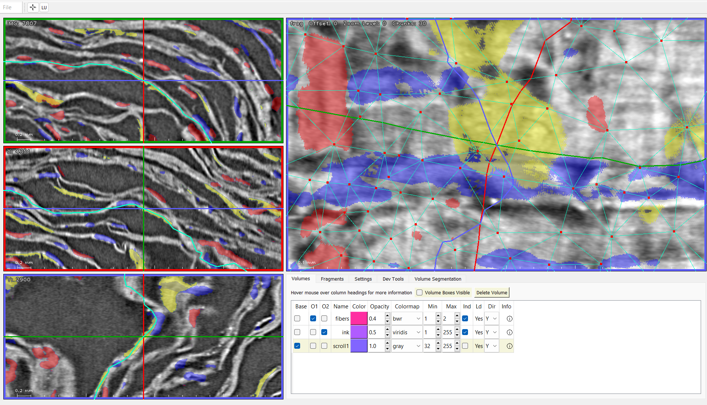
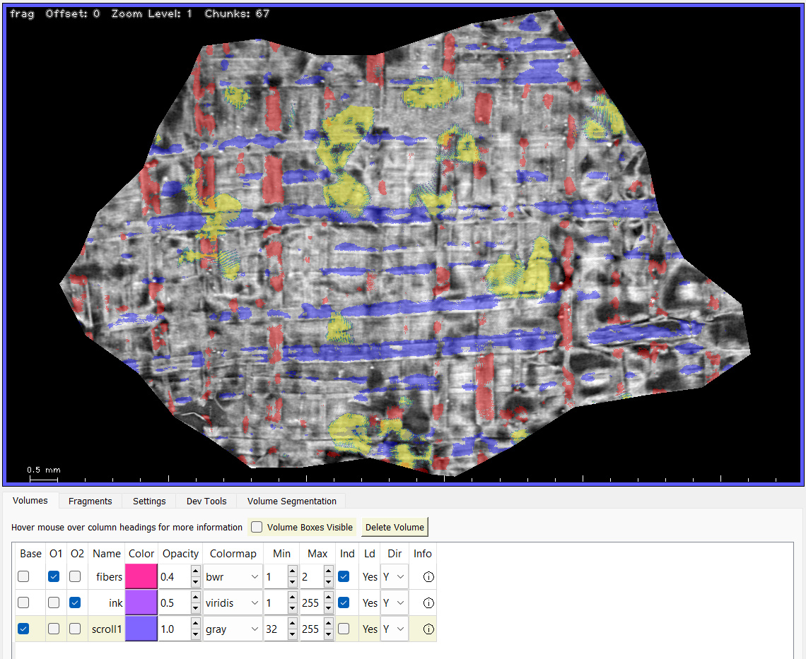

# Overlaying data sets in khartes

Khartes now lets you display multiple data
sets simultaneously, by overlaying them semi-transparently
on top of each other.

In this image, the scroll data is overlaid by detected
fibers (blue horizontal,
red vertical) and by detected ink (yellow).

More specifically, using the dataset names shown in the Volumes tab: 

* "scroll1" is a uint16 zarr data store;

* "fibers" is a uint8 zarr data store, created by Sean Johnson,
where pixels containing horizontal fibers are set to 1, and
pixels containing vertical fibers are set to 2 (all other pixels are
set to 0);

* "ink" is a uint8 zarr data store, created by Sean Johnson,
where pixels containing ink are set to 240 (all other pixels are
set to 0).

## Selecting which volumes to display

In the image above, in the Volumes tab, the three left columns
are labeled `Base`, `O1`, and `O2`.  The `O1` and `O2` stand for
'Overlay 1' and 'Overlay 2' respectively.

Each column contains check boxes that allow you to select which
volume (if any) to use for the base and the two overlays.

Every time khartes redraws the slice and fragment windows,
it starts by drawing the base
volume, and it then draws the two overlays (if any have been specified). 

## Setting the drawing parameters

The Volume tab allows you to set the drawing parameters
for each volume.  These parameters control the volume's opacity,
its colormap, etc.

Proceeding from left to right in the Volumes tab:

### Color

Ignore the `Color` column.  It has no meaning in the context
of overlays.

### Opacity

This is a value between 0.0 and 1.0.  A
value of 0.0 means total transparency,
and 1.0 means total opacity.  The opacity value is used only for
the two overlays; it is ignored when drawing the base layer.

### Colormap

The colormap determines how the pixel values are mapped to colors.

Here are the colormaps that are currently available in khartes:

 gray

 viridis

 bwr

 cool

 bmr_3c

 rainbow

The default is gray.

### Min and Max

Depending on the data volume, you may not want the color map
to cover the entire range of pixel values.

For instance, suppose you have a fiber-detection volume where
pixel values are:

0. No fiber detected
1. Horizontal fiber detected
2. Vertical fiber detected
3. Horizontal and vertical fibers detected

In this case, you do not want the colormap to cover the entire
range of pixels; instead, you would like pixels with value 0
to be transparent, and for pixels with values 1, 2, and 3 to
have distinct colors.

To tell khartes your preference, you would set the Min column to 1,
and the Max column to 3.

When you do this, pixels with value 1 will be drawn with the
left-most color of your selected color map, pixels with value
2 will be drawn with the color in the middle of the color map,
and pixels with value 3 will be drawn with the right-most color.

The default values of Min and Max are 0 and 255 respectively,
meaning that the colormap spans the entire set of possible pixel values.

(**Note**: No matter the type of data in the volume, whether uint8 or
uint16, the user interface treats 255 as the maximum possible value,
which is internally rescaled for uint16 data sets).

### Ind

Volume data comes (to oversimplify greatly) in two types:
continuous, and discrete (also known as "indicator").

An example of continuous data is x-ray opacity.  A value of
240 is a more opaque than a value of 230, and
it makes sense to say that a value of 235 represents
an opacity halfway between 230 and 240.

In other words, continuous data can be interpolated in a way
that makes sense.

An example of indicator data is the fiber-detection volume mentioned
above.  A value of 1 represents the presence of a horizontal
fiber, and a value of 3 represents the presence of both vertical
and horizontal fibers.  But these values shouldn't be interpolated.
For instance, the arithmetic average of 1 and 3 is 2, but you would
not say that a vertical fiber (which 2 corresponds to) is an
average of horizontal and horizontal-plus-vertical fibers.

So arithmetic interpolation of indicator values doesn't make sense.

When khartes displays volumes, it needs to interpolate,
because the volume pixels don't align with the display pixels.
If the data volume contains continuous data, khartes uses linear
interpolation.  If the data volume contains indicator data,
khartes uses nearest-neighbor interpolation.

The `Ind` checkbox simply tells khartes what kind of data the
volume contains (indicator or continuous), so that khartes can
use the appropriate interpolation method.
